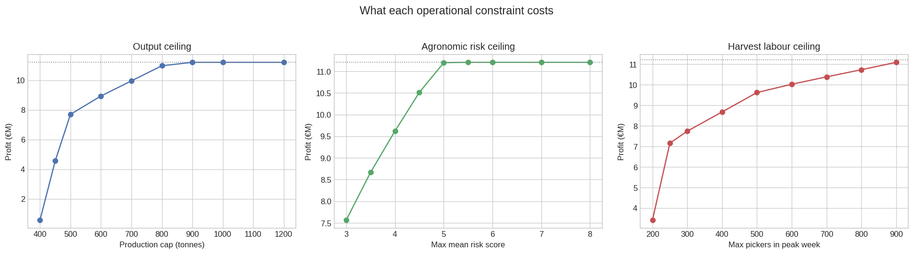
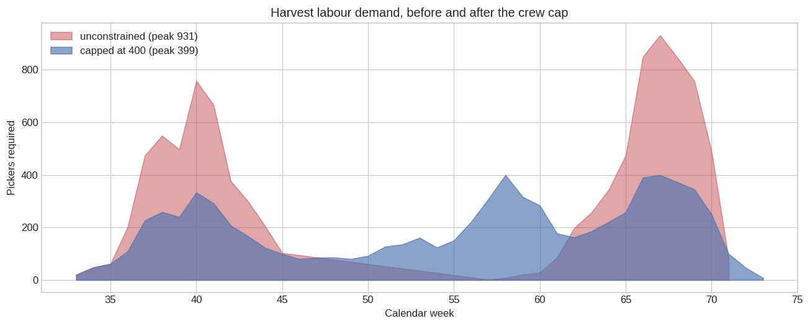

# Greenhouse Berry Production Optimization

A mixed-integer programme that assigns each of 24 greenhouses one production
scenario — crop, variety, planting method and planting week — to maximise
season profit, and then prices what each operational constraint costs.

The unconstrained optimum is **€11.21 M**. It is also not a plan anyone could
execute: it puts one raspberry variety in 21 of 24 greenhouses and needs **931
pickers in a single week**. The useful output of this project is not that
number but the trade-off curves around it.



## Headline results

| Plan | Profit | Give-up | Peak crew | Mean risk | Varieties |
|---|---|---|---|---|---|
| Unconstrained optimum | €11.21 M | — | 931 | 5.38 | 2 |
| Mean risk ≤ 5.0 | €11.20 M | 0.08% | 1,025 | 5.00 | 1 |
| Crew ≤ 500 | €9.62 M | 14.2% | 500 | 4.54 | 3 |
| Crew ≤ 400, risk ≤ 4.5 | €8.42 M | 24.9% | 400 | 4.50 | 4 |
| Sector-uniform scenarios | €11.21 M | 0.00% | 931 | 5.38 | 2 |

Four findings fall out of these:

**Risk reduction is nearly free at the margin.** Mean agronomic risk drops from
5.38 to 5.00 for €9,000, under a tenth of a percent of profit. Past that it
gets expensive fast: 4.0 costs 14%, 3.0 costs 32%.

**Labour capacity is what actually shapes the farm.** It is the only constraint
that forces diversification, and it does so without being asked. The
unconstrained plan uses 2 scenarios; capped at 400 pickers it uses 5; at 200 it
uses 11. To harvest with a smaller crew the farm must stagger plantings so the
peaks stop coinciding. The monoculture in the unconstrained answer was never an
agronomic recommendation — it was an artefact of treating labour as free and
infinite.



**The constraints interact in a way neither shows alone.** Minimising risk on
its own pushes peak labour *up* to 1,025 pickers. Capping the crew at 500
delivers a mean risk of 4.54 as a side effect, so the risk constraint then costs
nothing. Optimising either in isolation would have missed this.

**Sector uniformity is free.** The unconstrained optimum already satisfies it,
so the farm can impose it as an operational simplification at zero cost.

**There is very little room to shrink output.** The production ceiling is slack
above ~825,000 kg, erodes gently down to 500,000 kg, then collapses: at 400,000
kg the farm loses 95% of its profit, because establishment costs are per hectare
and do not scale down with yield.

## The model

**Decision.** Binary $x_{ijk}$ for each feasible combination of greenhouse $i$,
scenario $j$ and planting week $k$. 1,150 options after the sector rules.

**Objective.** Maximise $\sum_{ijk}(CA_{ijk} - CV_{ij})\,x_{ijk}$, where revenue
aligns each week of yield against the price in the calendar week it lands:

$$CA_{ijk} = S_i \sum_{w=1}^{37} Y_{jw}\;P_{c(j),\,k+w+d_j}
\qquad CV_{ij} = S_i \, C_j$$

with $S_i$ the surface, $Y_{jw}$ the yield in production week $w$, $d_j$ the
establishment delay, $c(j)$ the crop and $P$ the weekly market price.

**Constraints.** One scenario per greenhouse, always. Then four switchable ones,
each a keyword argument to `solve_plan`:

| Argument | Effect |
|---|---|
| `production_cap` | total season output ceiling, kg |
| `max_avg_risk` | ceiling on mean agronomic risk score |
| `max_peak_labour` | ceiling on pickers needed in the busiest week |
| `sector_uniform` | all greenhouses in a sector share a scenario |

Labour is derived rather than given: weekly yield divided by the per-scenario
picking speed from `Charges_var.csv`, over a six-day harvest week, summed across
every greenhouse harvesting in the same calendar week.

## Data quality

Three defects in the source files silently change the model's behaviour.
`validate_data()` reports them rather than absorbing them:

- **The 2.87 ha sector-5 ceiling never binds.** The largest greenhouse is 1.9 ha,
  so the clause excludes nothing. It is kept because it is part of the stated
  problem.
- **Scenario 14 is disabled by a sentinel.** Its cost is €100,000,000/ha against
  a €800,000 median, and its picking speed is 100 kg/person-day against a 14–20
  norm. These are placeholders, not prices, so the farm really chooses among 14
  scenarios, not 15.
- **36 weeks are unpriced** across the two crops. Harvest landing there earns
  nothing, which makes planting-week choice matter more than it appears.

## Running it

```bash
git clone https://github.com/AnasSABBAHI/greenhouse-production-optimization
cd greenhouse-production-optimization

python -m venv venv
source venv/bin/activate        # Windows: venv\Scripts\activate
pip install -r requirements.txt

jupyter lab
```

The PuLP pin matters: PuLP 4.0 removed `LpVariable.dicts` and changed the
`LpVariable` constructor, so an unpinned install will not run this code.

1. `notebooks/1_model_and_base_solution.ipynb` — data validation, formulation,
   the unconstrained optimum and why it is not executable
2. `notebooks/2_tradeoff_analysis.ipynb` — the three frontiers, constraint
   interactions, candidate plans

Labour-constrained solves use a 1% relative MIP gap, well inside the precision
of the underlying yield forecasts. Without it a sweep takes hours, because the
labour constraint couples every greenhouse through shared harvest weeks.

## Layout

```
├── data/               Production, Prices, Simulation, Charges_var
├── docs/projet.pdf     original problem statement
├── notebooks/          1_model_and_base_solution, 2_tradeoff_analysis
├── src/model.py        data loading, validation, option enumeration, MILP
├── reports/figures/    generated plots
└── requirements.txt
```

## Limitations

- Risk scores are an ordinal 3–10 judgement. Averaging ordinal scores is a
  convenience, not a defensible risk measure; correlated loss scenarios would be
  the proper treatment.
- Prices are deterministic. Since planting-week choice is essentially a bet on
  the price curve, a stochastic or robust formulation is the natural next step.
- Labour assumes a flat six-day week and ignores travel, training and worker
  availability.
- Single season, single farm. No validation against realised outcomes.

## License

MIT — see [LICENSE](LICENSE).
